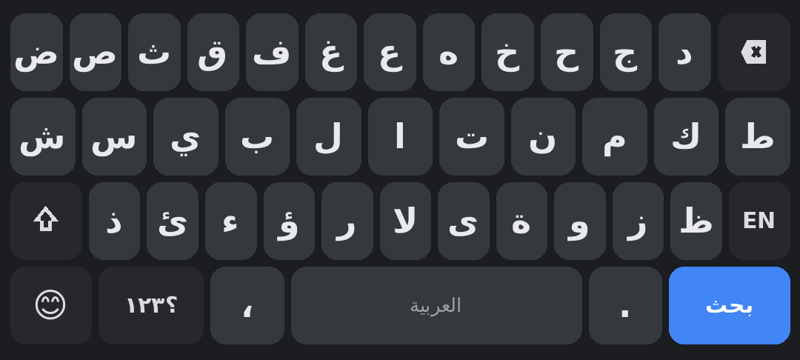
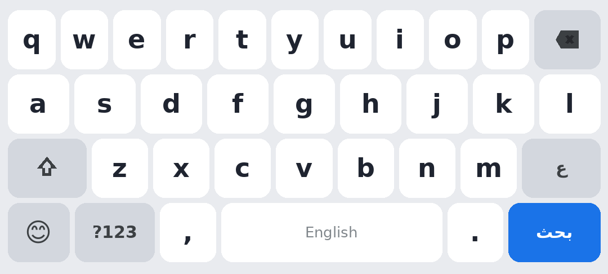

# DRS Smart Keyboard — لوحة المفاتيح الذكية 🎹

لوحة مفاتيح أندرويد عربية متكاملة ومفتوحة المصدر، مبنية بالكامل بـ Java على Canvas بدون أي مكتبات خارجية.

<p align="center">
  
  
</p>

## ✨ الميزات (v2.5)

### إصلاح مظهر الحروف + تطبيق متعدد الشاشات — جديد 2.5
- 🖋 **حروف أكبر وأوضح في اللوحة**: تكبير خط الحروف من ٣٦٪ إلى ٤٧٪ من ارتفاع الزر مع خط عريض، وتكبير نص المسافة وزر اللغة وزر الإدخال
- 🧹 **لوحة أنظف وأنيق**: إخفاء الرموز الصغيرة الزاوية عن الحروف (تُترك للأرقام والرموز المفيدة فقط) — كل البدائل متاحة بالضغط المطوّل
- 📱 **تطبيق متعدد الشاشات**: ٥ شاشات كاملة — الرئيسية (حالة حية + إحصاءات + وصول سريع) · الثيمات (معرض بعمودين) · الإعدادات (أقسام منظمة) · الفحص الذكي (حلقة نتيجة دائرية) · حول (دليل مصوّر)
- 🎯 **شريط تنقّل سفلي** بأيقونات مرسومة بالكامل عبر Canvas وحالات تفاعلية
- 🎨 **هوية بصرية موحدة**: نظام ألوان داكن أنيق، بطاقات دائرية، أزرار متدرجة، مفاتيح تبديل ملونة، أزرار مقسمة (Segmented) بدل أزرار الراديو، وانتقالات ناعمة بين الشاشات
- ⚡ **تحديثات حية**: بطاقة الحالة تتحدث فور العودة للتطبيق، وإحصاءات القاموس والاختصارات والإيموجي بالأرقام العربية

### إصلاح فحص سلامة التخطيطات — 2.4
- ✅ **زر الإدخال (Enter) في لوحة التحرير**: كان الفحص الذكي يكشف فقدانه من لوحة تحرير النص — أُضيف إلى صف الأسهم
- 📐 **عقد فحص مخصص لكل لوحة**: الفحص الذكي أصبح أعدل — لوحة الأرقام لا تتطلب مسافة، وشريط الإيموجي يُفحص كصف تنقّل واحد بمسح فقط
- 🕵️ **رسائل تشخيص أدق**: عند وجود خلل يسمي الفحص الزر الناقص ورقم الصف واسم اللوحة بدلاً من رسالة عامة
- 🔬 **نتيجة الفحص بعد الإصلاح**: سلامة التخطيطات ✔ — ٤٢٧ زراً في ٥١ صفاً (٦ لغات + رموز + تحرير + أرقام)

### نظام الفحص الذكي المتكامل + الحماية من الأعطال — 2.3
- 🛡️ **إصلاح جذري لعطل الإغلاق الفوري عند بدء الكتابة** (سببه ترتيب تحديد الثيم قبل بناء الألواح)
- 🕵️ **الفحص الذكي الشامل** في التطبيق: ١٤ فحصاً تغطي التسجيل في النظام، التفعيل والاختيار، سلامة التخطيطات بست لغات، قاعدة الإيموجي، القواميس، محرك التصحيح والسحب، الثيمات الستة عشر، الإعدادات، الموارد، وسجل الأعطال — مع درجة من 100 وتقرير قابل للنسخ
- 🔧 **إصلاح ذاتي**: الفحص يكتشف قيم الإعدادات التالفة ويعيد ضبطها تلقائياً
- 🚑 **حماية من الأعطال (CrashGuard)**: أي استثناء في أي نقطة من الخدمة أو الرسم أو اللمس يُسجَّل داخلياً ولا يُغلق التطبيق، وعند الحاجة تُستعاد اللوحة في «وضع آمن» فوراً
- 📋 **سجل أعطال داخلي** يظهر ملخصه في الشاشة الرئيسية مع زر مسح

### الكتابة بالسحب (Glide Typing) — جديد 2.2
- 👆 **اكتب كلمة كاملة بضربة واحدة**: مرّر إصبعك على حروف الكلمة وسيرسم أثراً ملوناً ثم يقترح الكلمة
- 🧮 مطابقة هندسية لمسار الإصبع مع مراكز الحروف (عربي مُطبَّع + إنجليزي) والبدائل تظهر في الشريط للتصحيح بنقرة
- 🕶 **الوضع التخفي**: الدرع في الشريط يوقف التعلّم والتقاط الحافظة وسجل الإيموجي فوراً

### الكتابة الذكية
- 🔮 **شريط تنبؤ ذكي**: اقتراح 3 كلمات أثناء الكتابة (قاموس عربي + إنجليزي مضمّن + ثنائيات الكلمات)
- ⚡ **الاختصارات النصية**: اكتب «سلام» ثم مسافة فيتوسّع تلقائياً — وأنشئ اختصاراتك الخاصة من الإعدادات
- 🧠 **تعلّم الكلمات**: يحفظ الكلمات التي تكتبها ويقترحها أولاً في المرة القادمة
- ✅ **تصحيح تلقائي** لمسافة تعديل 1 عند الضغط على المسافة (عربي بعد التطبيع + إنجليزي) قابل للتراجع
- ⌨️ **صف أرقام اختياري** فوق الحروف (عربي ١-٠ ببدائل غربية) + لوحة أرقام كاملة بالضغط المطوّل
- 🔠 أحرف كبيرة تلقائية + نقطة تلقائية بضغطتين على المسافة + تشكيل بالضغط المطوّل

### اللغات (6 لغات)
العربية (قياسية 101 كاملة بالحركات) — English QWERTY — Français AZERTY — Deutsch QWERTZ — Español (ñ، á é í) — Türkçe (ğ ü ş ö ç) — والتبديل بضغطة أو بقائمة الضغط المطوّل

### الأدوات
- 🗖 **الوضع العائم**: من زر «تحرير» → «عائم» فتصبح اللوحة نافذة صغيرة تسحبها إلى أي مكان بالشاشة
- 📋 **مدير الحافظة**: آخر 10 عناصر منسوخة + تثبيت حتى 5 عناصر، لصق بنقرة
- 🎤 **الإدخال الصوتي**: المايكروفون يكتب ما تنطقه مباشرة في المؤشر
- 💾 **نسخ احتياطي/استعادة**: صدّر إعداداتك وقاموسك واختصاراتك وحافظتك كنص JSON واستوردها على أي جهاز
- ✏️ **لوحة تحرير النص**: تحديد الكل، نسخ، قص، لصق، أسهم، بداية/نهاية، حذف كلمة
- 😊 **إيموجي مصنّف**: 10 تصنيفات + الأحدث المستخدمة (يُحفظ تلقائياً)
- 👆 سحب على المسافة لتحريك المؤشر + ضغط مطوّل للبدائل والحركات
- 🚀 مسح متسارع تدريجياً + Caps Lock بالضغط المطوّل على ⇧
- 🔉 3 أنماط صوت نقر + مدة ضغط مطوّل قابلة للضبط (سريع/عادي/بطيء)

### المظهر
- 🎨 **16 ثيماً مسمّى**: DRS ذكي (كحلي بتوهج بنفسجي)، سايبر، نيون، منتصف الليل، وردة ذهبية، غروب، زمرد، ملكي، بحري، رملي، شرقي، فضائي، AMOLED، ليلي، نهاري، تلقائي
- 📱 وضع اليد الواحدة (يمين/يسار) + 3 أحجام للمفاتيح
- صوت واهتزاز قابلان للتحكم

## 📦 التحميل والتثبيت

حمّل أحدث إصدار من صفحة [Releases](https://github.com/CTO-DRS/arabic-keyboard/releases) أو مباشرة:

```
https://github.com/CTO-DRS/arabic-keyboard/releases/latest
```

1. ثبّت ملف APK (فعّل «مصادر غير معروفة» إن طُلب)
2. افتح التطبيق → «تفعيل اللوحة في إعدادات النظام»
3. «اختيارها كلوحة الإدخال الحالية»
4. اكتب في الحقل التجريبي أو أي تطبيق!

يدعم Android 5.0 (API 21) حتى Android 14 (API 34) — حجم الحزمة ~130KB فقط.

## 🛠️ البناء من المصدر

المشروع لا يستخدم Gradle — سكربت واحد يبني كل شيء:

```bash
# يتطلب: JDK 21، Android SDK (platforms;android-34 + build-tools;34.0.0)
bash scripts/build_apk.sh
# الناتج: dist/Arabic-Keyboard.apk موقّعة وجاهزة
```

خطوات السكربت: `aapt2 compile/link` → `javac` → `D8 (R8 8.5.35)` → `zipalign` → `apksigner`.
يولّد مفتاح توقيعاً تلقائياً عند أول بناء (`keystore.jks` — لا ترفعه أبداً).

## 📁 بنية المشروع

```
├── AndroidManifest.xml        خدمة IME + النشاط الرئيسي
├── src/com/zai/arabickeyboard/
│   ├── ImeService.java        خدمة الإدخال: الألواح، اللغات، التنبؤ، التحرير
│   ├── KeyboardView.java      الرسم الكامل بـ Canvas + شريط الاقتراحات
│   ├── Layouts.java           6 لغات + رموز + لوحة تحرير + مجموعات إيموجي
│   ├── SuggestEngine.java     محرك التنبؤ: قواميس + تعلّم + تصحيح
│   ├── Words.java             قواميس الكلمات الشائعة (عربي/إنجليزي)
│   ├── ThemeSet.java          16 ثيماً بتدرجات لونية
│   ├── MainActivity.java      شاشة الإعدادات (أقسام، معاينات، قاموس)
│   ├── Prefs.java / Key.java / Row.java
├── res/                       موارد أندرويد (واجهة عربية RTL)
├── scripts/build_apk.sh       سكربت البناء الكامل
└── .github/workflows/         CI يبني APK عند كل push وينشر الإصدارات
```

## 🔄 الإصدارات

| الإصدار | أبرز الميزات |
|---------|--------------|
| v2.5 | **إصلاح مظهر الحروف** (أكبر وأوضح وأكثر أناقة) + **تطبيق متعدد الشاشات** بتصميم عصري موحد وشريط تنقّل سفلي |
| v2.4 | **إصلاح فحص سلامة التخطيطات**: زر Enter في لوحة التحرير + عقد فحص مخصص لكل لوحة + رسائل تشخيص دقيقة |
| v2.3 | **إصلاح عطل الإغلاق الفوري عند الكتابة** + نظام الفحص الذكي المتكامل (١٤ فحصاً) + حماية من الأعطال بإصلاح ذاتي واستعادة آمنة |
| v2.2 | كتابة بالسحب، وضع عائم، اختصارات نصية، وضع تخفي، نسخ احتياطي، 16 ثيم |
| v2.1 | تطبيع عربي للتصحيح، ثنائيات، إدخال صوتي، لوحة أرقام، تثبيت حافظة |
| v2.0 | تنبؤ ذكي، 6 لغات، حافظة، لوحة تحرير، إيموجي مصنّف، 12 ثيم، يد واحدة |
| v1.2 | إصلاحات + أول Release رسمي |
| v1.1 | ألوان تمييز، صف أرقام، نقطة تلقائية، تسريع المسح |
| v1.0 | الإصدار الأول: عربي/إنجليزي/رموز/إيموجي |

## 📄 الرخصة

MIT — انظر [LICENSE](LICENSE).
